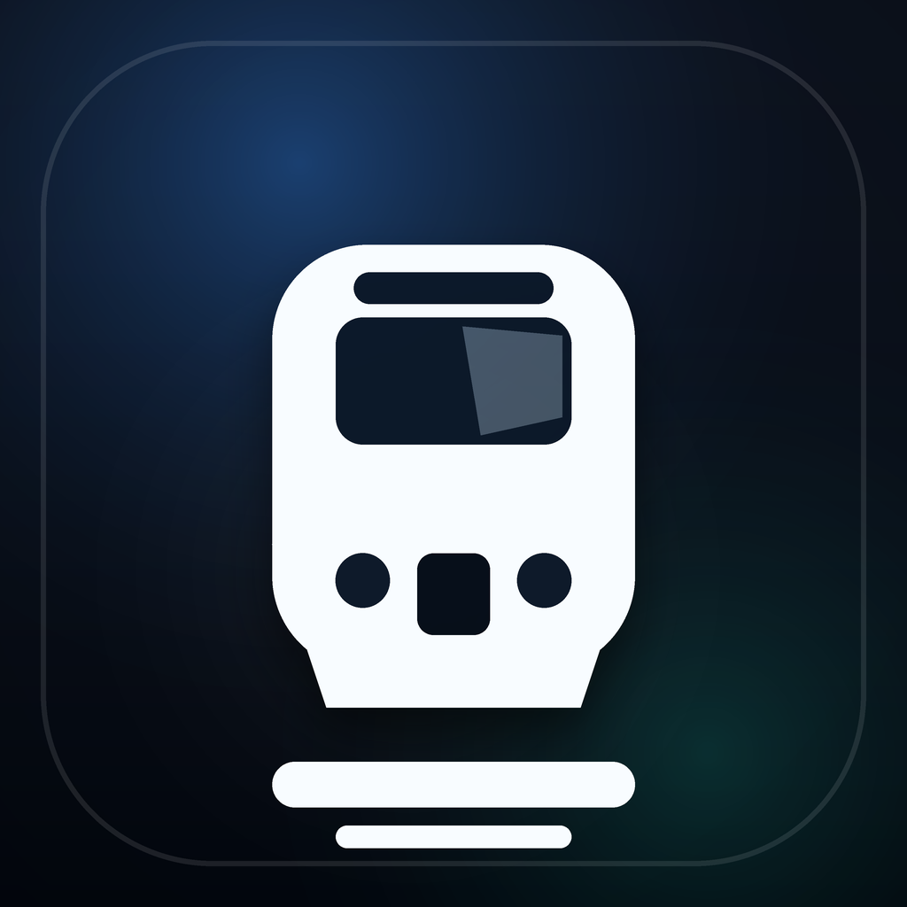
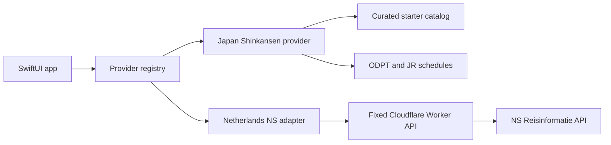

<p align="center">
  
</p>

<h1 align="center">Trainy</h1>

<p align="center"><strong>Know what comes next—from platform to destination.</strong></p>

Trainy is a native iOS rail companion for the moments when a timetable alone is
not enough. It brings trip progress, station boards, platforms, connections,
service alerts, and source freshness into one place so riders can understand
what is happening and what to do next.

The current rider-ready experiences cover Japan's Shinkansen network and
Netherlands NS stations. Trainy labels starter, scheduled, and realtime data
separately instead of presenting every source as live.

> **Project status:** Trainy is a working Build Week project and simulator-ready
> beta. Its shipped contents have passed a Release archive audit, but it is not
> yet distributed through the App Store or TestFlight.

## What Trainy does

- Finds and tracks Shinkansen services across Japan's major high-speed lines.
- Shows route progress, the next stop, platforms, station timelines, maps, car
  positioning, alerts, and connection guidance.
- Searches Netherlands NS stations and displays current departure boards and
  disruptions through a credential-safe production proxy.
- Preserves tracked trips, pins, notification choices, provider selection, and
  display preferences on-device.
- Explains where each result came from, how fresh it is, and whether it is
  starter, scheduled, stale, or realtime data.
- Supports first-run guidance, Light and Dark Mode, VoiceOver semantics, and
  accessibility layouts through AX2XL Dynamic Type.

## Rider-ready data

| Region | Status | Current experience | Data path |
| --- | --- | --- | --- |
| Japan | Rider-active | Shinkansen search, tracked trips, route details, maps, and source-aware schedules | Credential-free starter catalog; optional ODPT timetable and alert data; official JR timetable fallback when applicable |
| Netherlands | Rider-active when the public proxy URL is configured | NS station search, departures, disruptions, freshness, and recovery states | Trainy iOS → fixed Cloudflare Worker contract → NS Reisinformatie API |
| Other regions | Planned or research-ready | Visible in the provider directory but unavailable for rider selection | Provider access does not count as an implemented Trainy experience |

The full provider-access record is in
[`docs/Provider_Status.md`](docs/Provider_Status.md). The app's provider registry
is the authority for what riders can use now.

## Quick start

### Requirements

- macOS with Xcode and an iOS Simulator runtime.
- Xcode 26.5 and iOS 26.5 are the verified configuration.
- Internet access for the first Swift package resolution.

You do **not** need an Apple Developer account or a provider credential to run
Trainy in the simulator.

### Build and run with Xcode

```bash
git clone https://github.com/Elemperor1/Trainy.git
cd Trainy
open TrainyIOS/Trainy.xcodeproj
```

In Xcode:

1. Select the **Trainy** scheme.
2. Choose an iPhone 17 simulator.
3. Press **Run** (`Command-R`).

The default credential-free launch presents onboarding and the Shinkansen
starter catalog.

To enable the production-backed NS station experience from Xcode, add this
non-secret environment variable to the scheme's **Run → Arguments** settings:

```text
TRAINY_PROVIDER_PROXY_BASE_URL=https://trainy-ns-provider-proxy.trainy-jacob.workers.dev
```

### Canonical command-line build

The repository-owned wrapper builds the same app without code signing or an
ODPT key:

```bash
ODPT_ENV_FILE=/dev/null \
TRAINY_PROVIDER_PROXY_BASE_URL='https://trainy-ns-provider-proxy.trainy-jacob.workers.dev' \
CODE_SIGNING_ALLOWED=NO \
scripts/build-ios.sh
```

The app bundle is written under
`/private/tmp/trainy-derived/Build/Products/Debug-iphonesimulator/Trainy.app`.
If Xcode is installed at `/Applications/Xcode.app`, prefix the command with
`XCODE_APP=/Applications/Xcode.app`. The script otherwise uses the verified
non-App-Store installation at `/Applications/Xcode-26.5.0.app`.

To install the command-line build:

```bash
DEVICE='iPhone 17'
UDID=$(xcrun simctl list devices available | awk -v d="$DEVICE" -F'[()]' '/\(/ && $0 ~ d {gsub(/^ +| +$/,"",$2); print $2; exit}')
xcrun simctl boot "$UDID" || true
open -a Simulator
xcrun simctl install "$UDID" /private/tmp/trainy-derived/Build/Products/Debug-iphonesimulator/Trainy.app
xcrun simctl launch "$UDID" com.jacobcyber.Trainy
```

Plain `swift build` and `swift test` target the macOS host by default and are not
valid app gates for this iOS-only project. Use the Xcode wrapper and simulator
schemes instead.

## Optional ODPT development setup

Trainy works without ODPT. To exercise the optional authenticated Japan path,
create the ignored local file and keep it private:

```bash
cp TrainyIOS/Config/odpt.env.example TrainyIOS/Config/odpt.env
chmod 600 TrainyIOS/Config/odpt.env
```

Add the key issued by the [ODPT developer portal](https://developer.odpt.org/),
then run `scripts/build-ios.sh` and `scripts/smoke-odpt.sh`. The parser accepts
only the expected key assignment and never executes the env file as shell code.
Do not commit local provider env files.

## Architecture

Trainy is package-first with a thin Xcode application wrapper:



- `TrainyIOS/Trainy/` owns the app lifecycle, resources, privacy manifest, and
  packaging.
- `Sources/TrainyCore/` owns models, provider adapters, persistence, SwiftUI
  screens, maps, and the design system.
- `Tests/TrainyCoreTests/` contains deterministic model, provider, provenance,
  persistence, security-boundary, and design-system coverage.
- `provider-proxy/` is the TypeScript Cloudflare Worker that protects the NS
  subscription key and returns bounded normalized responses.

The NS Worker is not a general relay. It exposes only health, station search,
departures, and disruptions. Inputs, upstream operations, response fields,
timeouts, cache behavior, rate limits, and error shapes are fixed by the
Worker. See [`provider-proxy/README.md`](provider-proxy/README.md) for the full
contract.

## How Codex and GPT-5.6 were used

I used **GPT-5.6 through Codex** as an engineering collaborator throughout
OpenAI Build Week. Trainy does not call GPT-5.6 at runtime; the model was used
to help build and verify the product.

- **Architecture:** Codex traced the existing SwiftUI, persistence, provider,
  and build paths before proposing changes. GPT-5.6 helped shape the provider
  registry and the narrow app → proxy → NS trust boundary.
- **Implementation:** Codex helped implement the NS Worker and adapter,
  source-aware provider states, station search and departures, accessible
  onboarding, and release/privacy controls.
- **Testing:** GPT-5.6 helped create production dependency-injection seams,
  credential-neutral fixtures, unit tests, and XCUITests for onboarding, search,
  no-match recovery, loading/failure recovery, provider truth, NS departures,
  Light/Dark Mode, and AX2XL.
- **Debugging and review:** Codex ran focused checks, interpreted concrete Xcode
  and simulator failures, addressed review feedback, and expanded to the
  canonical build and full test suite once each change was stable.
- **Release readiness:** GPT-5.6 helped inspect the final `.xcarchive`, privacy
  manifests, dSYM, generated plists, Crashlytics behavior, build metadata, and
  credential fingerprints. Verified findings were fixed and re-audited with
  repository-owned scripts.

I supplied the product direction, provider access, visual decisions, release
choices, and final review. Credentials, deployments, signing, and the hackathon
submission remained human-controlled.

## Testing and verification

### iOS suite

Run the same shared scheme used by CI:

```bash
DEVELOPER_DIR="$(xcode-select -p)" \
ODPT_CONSUMER_KEY='' \
xcodebuild test \
  -quiet \
  -project TrainyIOS/Trainy.xcodeproj \
  -scheme TrainyTests \
  -destination 'platform=iOS Simulator,name=iPhone 17,OS=latest' \
  -derivedDataPath /private/tmp/trainy-derived \
  -clonedSourcePackagesDirPath /private/tmp/trainy-source-packages \
  -packageCachePath /private/tmp/trainy-swiftpm-cache \
  -parallel-testing-enabled NO \
  CODE_SIGNING_ALLOWED=NO \
  TRAINY_SOURCE_PACKAGES_DIR=/private/tmp/trainy-source-packages
```

The suite uses in-memory fixtures and ordinary production screens. It requires
no provider credential and makes no live provider request. Focused UI execution
and stability instructions live in
[`docs/simulator-ui-automation.md`](docs/simulator-ui-automation.md).

### Repository gates

```bash
npm ci --prefix provider-proxy
npm run check --prefix provider-proxy
bash scripts/check-design-system-bypass.sh --self-test
bash scripts/check-design-system-bypass.sh
python3 scripts/test-provider-secret-boundary.py
bash scripts/test-provider-smoke-pattern.sh
bash scripts/smoke-source-provenance.sh
bash scripts/smoke-provider-registry.sh
bash scripts/smoke-shinkansen-provider.sh
```

### Most recent audited baseline

The dated baseline below describes the verified Release candidate from July 21,
2026; it does not silently claim that later working-tree changes have passed.

| Gate | Result |
| --- | ---: |
| Canonical credential-neutral iOS build | Passed |
| Xcode `TrainyTests` scheme | 66/66 passed |
| Cloudflare Worker contract tests | 35/35 passed |
| Design-system guard fixtures | 27/27 passed |
| Repository design-system scan | 29 files passed |
| Release archive audit | 44 checks, 0 failures |

See
[`docs/distribution-readiness-2026-07-21.md`](docs/distribution-readiness-2026-07-21.md)
for the archive identity, commands, findings, and limitations.

## Privacy and security

- Provider credentials do not ship in the iOS app. The NS key exists only as a
  Worker secret; local smoke credentials remain in ignored mode-`0600` files.
- Release builds contain no ATS exception and accept only the approved public
  HTTPS proxy. Loopback HTTP is limited to the simulator development path.
- Trainy's first-party privacy manifest declares no tracking, no tracking
  domains, no collected data, and only the required UserDefaults API reason.
- Firebase Analytics and Ads are disabled. Crashlytics collection is off by
  default and requires an explicit rider opt-in in Settings.
- Trainy adds no trip details, searches, user identifier, custom key, or custom
  log to Crashlytics.
- Release archives can be created in validation-only mode so an audit does not
  upload symbols or distribute an artifact.

## Release status

The current Release archive is **content-audited but unsigned**. A separate
Release-configured device build passed strict verification with a Personal Team
Apple Development profile for one registered iPhone. That build is suitable for
the device demo only; it is not an App Store or TestFlight distribution build.

A distribution release still requires an active paid Apple Developer Program
team, a new distribution-signed export, and a repeat of the signature,
entitlement, privacy, provenance, and secret audit. Do not treat the Personal
Team build or unsigned archive as distribution proof.

## Other repository surfaces

The native iOS app is the product. The repository also contains supporting
surfaces:

- `index.html`, `app.js`, `components.js`, and `styles.css`: a dependency-free
  browser prototype. Run it with `python3 -m http.server 4173`.
- `marketing/trainy-coming-soon/`: a Next.js coming-soon site.
- `marketing/trainy-launch-video/`: editable Remotion source and production
  notes for Trainy's Build Week launch film.
- `animation-plans/`: motion and launch-film review notes.

## Repository map

| Path | Purpose |
| --- | --- |
| `TrainyIOS/` | Xcode project, app wrapper, resources, UI tests, and iOS-specific documentation |
| `Sources/TrainyCore/` | Reusable app models, providers, views, persistence, and design system |
| `Tests/TrainyCoreTests/` | Unit, fixture, provider-contract, and design-system tests |
| `provider-proxy/` | Credential-safe Netherlands NS Cloudflare Worker |
| `scripts/` | Canonical build, smoke, audit, archive, and policy gates |
| `docs/` | Provider, design, automation, release, and distribution evidence |
| `marketing/` | Coming-soon site and launch-film production source |

## Further documentation

- [iOS implementation and provider setup](TrainyIOS/README.md)
- [Deterministic simulator UI automation](docs/simulator-ui-automation.md)
- [NS provider proxy contract and operations](provider-proxy/README.md)
- [Distribution-readiness audit](docs/distribution-readiness-2026-07-21.md)
- [Release-readiness history](docs/release-readiness-2026-07-19.md)
- [Design-system architecture](docs/design-system-architecture.md)
- [Build Week submission readiness](docs/devpost-build-week-2026-07-21.md)

## License

Trainy is proprietary, all-rights-reserved software. The source is published for
review only; no permission is granted to use, copy, modify, redistribute, host,
deploy, or create derivative works without prior written authorization. See the
[`LICENSE`](LICENSE) file for the complete notice. Separately identified
third-party materials remain subject to their own licenses and terms. The notice
includes a limited exception allowing OpenAI Build Week evaluators to download,
build, run, test, inspect, benchmark, and privately demonstrate Trainy solely
for judging, administering, documenting, and promoting Trainy's participation
in OpenAI Build Week.
